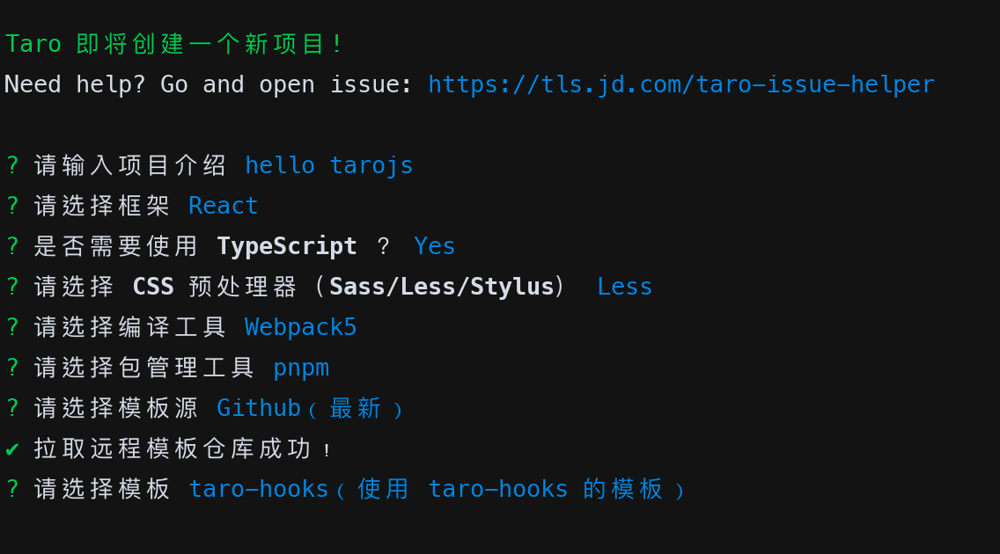

# Hello [`tarojs`](https://taro-docs.jd.com/docs/)

## Initialize

```bash
npx @tarojs/cli init hello-tarojs
```



## Run

### H5

```bash
pnpm dev:h5
```

## Features

- [x] css modules
- [x] eslint
- [x] zustand
- [x] tailwindcss
- [x] react-query
